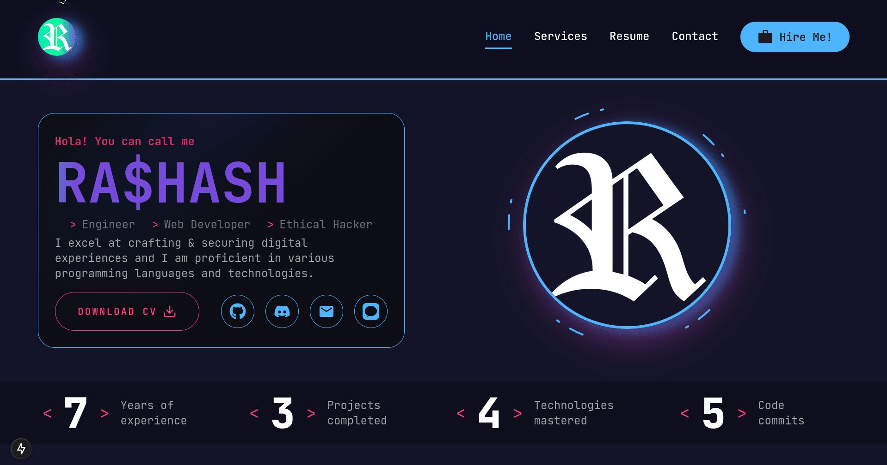

<div align="center">
  
</div>

<h1 align="center">
  My Developer Portfolio V 1.0
</h1>


## Getting Started
If you need any help with this project, don't hesitate to contact me, 
I'll be more than happy to help. All my contact info are on the project under the contact page. 

### .env Variables
At the root of your app, create a .env folder to store secrets safely & add the following to it 
```
NEXT_PUBLIC_EMAILJS_SERVICE = service_name
NEXT_PUBLIC_EMAILJS_TEMPLATE = template_name
NEXT_PUBLIC_EMAILJS_KEY = key
```
replace the service_name , template_name, & key with the corrosponding variables you got from emailJS

### Starting the dev server  
Install the dependenncies 
```bash
npm install
#OR
npm i
```
Runnding developmetnt wenviroment
```bash
npm run dev
```
Open [http://localhost:3000](http://localhost:3000) with your browser to see the result.


